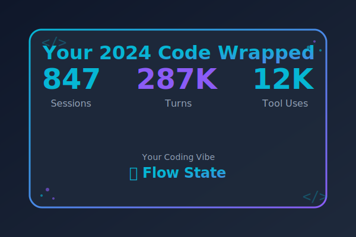

<p align="center">
  
</p>

<h1 align="center">Code Wrapped</h1>

<p align="center">
  <strong>Spotify Wrapped, but for your AI pair programming sessions.</strong>
  <br>
  <em>What did you really build this year?</em>
</p>

<p align="center">
  
</p>

---

You've been pair programming with AI all year. Thousands of prompts. Countless debugging sessions at 2am. That mass-refactoring spree in October.

**Code Wrapped** parses your local session history and turns it into something you can actually look at (and maybe share, if you're brave).

<p align="center">
  
</p>

## What You'll Discover

- **Your coding archetype** — Are you The Debugger? The Architect? The 3am Explorer?
- **Your vibe breakdown** — How much time in "flow state" vs "debugging hell"?
- **Your tool DNA** — Terminal warrior or edit-everything type?
- **Awards you didn't know you earned** — Night Owl, Marathon Coder, Repo Hopper...
- **The numbers** — Sessions, turns, tokens consumed, streaks

All from data that's already on your machine. Nothing leaves your computer unless you want it to.

## Quick Start

```bash
# Clone it
git clone https://github.com/cipher982/code-wrapped.git
cd code-wrapped

# Install (requires uv)
uv sync

# Generate your 2025 wrapped
uv run code-wrapped run --year 2025
```

Opens `data/output/wrapped-2025.html` in your browser. That's it.

### Options

```bash
# Add AI-generated narrative commentary
uv run code-wrapped run --year 2025 --narrate

# Just the JSON, skip the pretty stuff
uv run code-wrapped run --year 2025 --no-report

# Verbose mode (see what's being parsed)
uv run code-wrapped run --year 2025 -v
```

## What Gets Generated

```
data/output/
├── wrapped-2025.html          # Interactive report with charts
├── wrapped-2025.json          # Full stats (keep this private)
├── wrapped-2025-share.json    # Safe to share version
└── cards/
    ├── hero-stats.png         # Your big numbers
    ├── tool-fingerprint.png   # Your coding DNA
    ├── agent-comparison.png   # Claude vs Codex vs...
    └── award-*.png            # Your achievements
```

The PNG cards are sized for Twitter/social sharing (1200x630).

## Supported AI Agents

| Agent | Data Location | What's Parsed |
|-------|---------------|---------------|
| **Claude Code** | `~/.claude/projects/` | Sessions, tools, tokens, timestamps |
| **Codex** | `~/.codex/sessions/` | Sessions, messages, git context |
| **Cursor** | `~/Library/.../state.vscdb` | Composer sessions, modes |
| **Gemini** | `~/.gemini/tmp/` | Sessions, messages |

Don't use all of them? No problem — it'll work with whatever it finds.

## The Analytics

### Topics Detected
API integrations, frontend, backend, database, DevOps, testing, documentation, refactoring, debugging, AI/ML, mobile, security, performance, data processing

### Vibes Classified
- **Debugging Hell** — errors, stack traces, "why won't this work"
- **Flow State** — shipping, completing, "it works!"
- **Learning Mode** — "how does X work", exploring docs
- **Deep Work** — long sessions, complex problems
- **Exploration** — trying things, prototyping

### Archetypes Assigned
- **The Architect** — designs, structures, refactors
- **The Debugger** — fixes, investigates, traces
- **The Explorer** — asks "how", learns, experiments
- **The Builder** — creates, implements, adds features
- **The Shipper** — deploys, releases, pushes
- **The Tester** — validates, checks, covers

### Awards Earned
Night Owl, Early Bird, Marathon Coder, Speed Demon, Streak Master, Repo Hopper, Deep Diver, AI Whisperer, Polyglot, Weekend Warrior, Terminal Master, Bug Slayer

## Privacy

Your data stays local. The generated files in `data/output/` contain your personal stats — the `.gitignore` excludes them by default.

The `--narrate` flag sends aggregated stats (not code, not prompts) to the Anthropic API to generate commentary. Requires `ANTHROPIC_API_KEY`.

## Requirements

- Python 3.11+
- [uv](https://github.com/astral-sh/uv) (recommended) or pip
- Session data from at least one supported AI agent

## Development

```bash
# Install with dev dependencies
uv sync --group dev

# Run tests
uv run pytest

# Lint
uv run ruff check .
```

## How It Works

1. **Parse** — Reads JSONL/SQLite session files from each agent's data directory
2. **Normalize** — Converts to unified `Session` model with common fields
3. **Enrich** — Detects topics, vibes, archetypes via keyword matching
4. **Analyze** — Computes streaks, distributions, records, awards
5. **Generate** — Creates HTML report with Plotly charts + PNG cards with Pillow
6. **Narrate** (optional) — Sends context to Claude for Wrapped-style commentary

## FAQ

**Q: Why not just use the built-in stats from Claude/Cursor/etc?**
A: They don't exist. Also, cross-agent comparison is fun.

**Q: Is this official/affiliated with Anthropic/OpenAI/etc?**
A: No. It just reads the local files these tools create.

**Q: Can I share my wrapped publicly?**
A: The `wrapped-{year}-share.json` strips sensitive paths. The PNG cards are designed for sharing. The full JSON has everything — keep that private.

**Q: It says I have 0 sessions?**
A: Check that your AI tools store data in the expected locations. Run with `-v` to see what's being scanned.

## License

MIT

---

<p align="center">
  <em>Built during a mass debugging session at 1am. The irony is not lost.</em>
</p>
